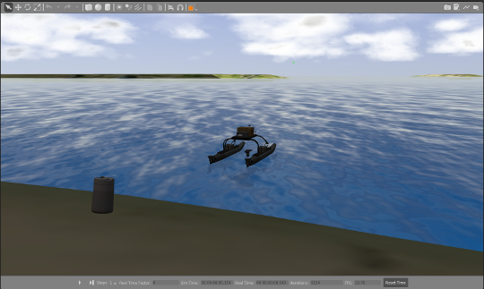

# RXI Tutorial: Custom, Randomized Worlds #

Creating custom worlds will allow you to expand on the VRX simulation basics to apply the tools to your own work and to future RobotX competitions.  In this tutorial we will build an example world with an assortment of tasks that could be used in RobotX 2020.  The goal is for teams to learn how to use VRX to accelerate their development and preparation for RobotX 2020.

## Examples

* [Adding Course Elements](https://bitbucket.org/osrf/vrx/wiki/tutorials/Adding%20course%20elements)
* [Randomized Obstacle Course](https://bitbucket.org/osrf/vrx/pull-requests/54/obstacle-course/diff)
* [Create Custom Docks](https://bitbucket.org/osrf/vrx/wiki/tutorials/CreateDocks)


# Setup

For this tutorial you will create you own ROS package called `rxi` to contain the custom world definition.  This ROS package should be in the same catkin workspace as the VRX packages.  The following instructions assume that your catkin workspace is named '~/vrx_ws'.

Make a new directory for the ROS package, initialize the package by creating blank CMakeLists.txt and package.xml files and build.
```
cd ~/vrx_ws/src/
mkdir rxi
catkin_create_pkg rxi
cd ~/vrx_ws
catkin_make
```

Make ROS aware of the new package by
```
source ~/vrx_ws/devel/setup.bash
```

Optional: This is a good time to setup version control for your `rxi` package.  If you are familiar with version control (e.g., git

## Create working launch and world files

### Copy working examples from the `vrx_gazebo` package

Make new directories in your rxi package and copy existing launch and world files from the `vrx_gazebo` package to provide a working example.
```
cd ~/vrx_ws/src/rxi
mkdir launch
mkdir worlds
cd launch
roscp vrx_gazebo vrx.launch ./rxi.launch
cd ../worlds/
roscp vrx_gazebo sandisland.world.xacro rxi.world.xacro
```

Next we will edit our new files so that we can verify they are a working starting point for creating a custom environment.

### Setup `xacro` processing for the package.

The `rxi.world.xacro` file uses the [xacro](http://wiki.ros.org/xacro) (XML Macros) utility to generate a [Gazebo world](http://gazebosim.org/tutorials?tut=build_world) file.  The file currently creates the basic Sand Island environment, an ocean wave model and an ocean wind model.  In order to setup the package to process the xacro file we'll want to do the following within the `rxi` package:

* Edit the `package.xml` file and add the following line:
  ```
  <depend>xacro</depend>
  ```
* Edit the `CMakeLists.txt` file and add the following lines at the bottom of the file:
```
find_package(catkin REQUIRED COMPONENTS
  xacro)

catkin_package(
  CATKIN_DEPENDS xacro)

# Generate world files from xacro and install
xacro_add_files(
  worlds/rxi.world.xacro
  INORDER INSTALL DESTINATION worlds)

# Install all the world files
install(DIRECTORY worlds/
  DESTINATION ${CATKIN_PACKAGE_SHARE_DESTINATION}/worlds)
```
* Re-make: (Note that each time you make changes to the `rxi.world.xacro` file you will need to run `catkin_make` for those changes to take effect.)
```
catkin_make
```

When you build the package the `rxi.world.xacro` file is processed, generating the `rxi.world` file that is installed in the system. (To see where try  `find ~/vrx_ws -name "rxi.world"`).

### Modify the launch file and test.

Next we will edit the `rxi.launch` file so that it uses the generated `rxi.world` file.

* Edit `rxi.launch` and change the default value of the world argument to point to the new `rxi.world` file in the `rxi` ROS package.
* To do this:
    * You'll need to change the argument after `find` from `vrx_gazebo` to `rxi`.
    * You'll also need to change the file name from `example_course.world` to `rxi.world`.

* Test your new launch file with...
```
source devel/setup.bash 
roslaunch rxi rxi.launch
```

This should generate a Gazebo window that looks something like this...




## Add models to the world file

The `vrx_gazebo` package includes a number of RobotX specific models (see [vrx_gazebo/models](https://bitbucket.org/osrf/vrx/src/default/vrx_gazebo/models/)).  These models are accessible through the Gazebo client GUI, but we will add them to the World file in order to create reusable worlds for development and practice.

### Add a buoy model to the world

Start by adding an instance of green navigational mark by adding the following text to the `rxi.world.xacro` file.  Place this XML block directly before the closing `</world>` tag.
```
  <include>
    <name>green_buoy_0</name>
    <uri>model://surmark950400</uri>
    <pose>0 0 0 0 0 0</pose>
  </include>
```

Test by rebuilding and running this simulation:
```
catkin_make
roslaunch rxi rxi.launch
```

You should see that the buoy is located at the origin of the gazebo coordinate frame as shown in the image below.


### Moving the buoy model

The [<pose>](http://sdformat.org/spec?ver=1.6&elem=model) tag specifies the position and orientation of the model, so in the example above the buoy is located at the origin of the gazebo coordinate frame.  We can change the position by editing the values with the pose tag.

For visually composing a scene it is often convenient to drag the objects using the [translate tool](http://gazebosim.org/tutorials?tut=build_world#Translation].  You can select the buoy model, then select the translate tool and move the buoy where you would like.  Here is a [short video](https://www.youtube.com/watch?v=x_qNg6sN6wk) illustrating the process.  

You can also edit the pose property of the model directly in the Gazebo client.  Select the model in the list of models and expand the properties pane below.  Then you can edit the x and y values to move the model.


Position the buoy in front of the WAM-V and then record the x and y position values.  Edit the `rxi.world.xacro` file so that the pose includes your new x and y values so that when you restart the simulation the buoy will appear in the same location.  In the block below, replace `X` and `Y` with the values from the client GUI.
```
  <include>
    <uri>model://surmark950400</uri>
    <pose>X Y 0 0 0 0</pose>
  </include>
```

### Build a navigation course

To exercise these new skills, build a simple navigation challenge course that we might use to practice for RobotX 2020.  

* Include two red buoys
* Include two green buoys
* Position the four buoys so that there is a red-green pair near the WAM-V and a pair farther from the WAM-V

When you are done, you should be able to `roslaunch rxi rxi.launch` and start a simulation world that looks similar to the image below.


## Generating a randomized obstacle field

Above we learned out to build a world by assembling model instances.  This is very useful for creating practice worlds to exercise and test your solutions.  As we learn about the RobotX 2020 tasks, many teams will want to create simulated representations of those tasks to start working on solutions.


### Example: Generating random obstacle field model
We may also want a way to quickly generate randomized worlds so that we can practice with lots of different scenarios for a particular task.  For RobotX 2018 the UF team created a python program to generate a randomized obstacle field model.  Notes on this contribution to VRX are in [PR#54](https://bitbucket.org/osrf/vrx/pull-requests/54/obstacle-course/diff).

The program makes use of a number of command line arguments to output an SDF model file to standard out.  Review the usage notes for the program with
```
rosrun vrx_gazebo generate_avoid_obstacles_buoys -h
```

* Create a model directory within the rxi package
```
cd ~/vrx_ws/src/rxi/
mkdir -p models/rxi_obstacles
cd models/rxi_obstacles
```

* Create a `model.config` file in the `models/rxi_obstacles` directory and copy the following text into the file:
```
<?xml version="1.0"?>
<model>
  <name>rxi_obstacles</name>
  <version>1.0</version>
  <sdf version="1.6">model.sdf</sdf>
  <author>
    <name>Your Name</name>
    <email>youremail@gmail.com</email>
  </author>
  <description>
    RXI tutorial
  </description>
</model>
```

* Use the program and redirection to generate the `model.sdf` file.  This example generates a field with one of each buoy type and with the default dimensions of 40x40 m. 
```
roscd rxi/models/rxi_obstacles
rosrun vrx_gazebo generate_avoid_obstacles_buoys --a3 1 --a5 1 --a7 1 --surmark46104 1 > model.sdf

```

* Review the output with `more model.sdf`

Now you should have both `model.config` and `model.sdf` files in the `rxi/models/rxi_obstacles/` directory.

### Export Gazebo models from RXI package

We'll need to modify the RXI ROS package so that the models are available to Gazebo.
* Edit the `package.xml` file so that at the end (before the closing `</package>` tag) the following lines are include:
```
  <depend version_gte="2.5.17">gazebo_ros</depend>
  <export>
    <gazebo_ros gazebo_model_path="${prefix}/models"/>
    <gazebo_ros gazebo_media_path="${prefix}"/>
  </export>
```
* Edit the `CMakeLists.txt` file, adding the following lines to the end of the file
```
# Install all the model files
install(DIRECTORY models/
  DESTINATION ${CATKIN_PACKAGE_SHARE_DESTINATION}/models)
```
### Add the new `rxi_obstacles` model to your world.

Now you have used the python script to generate an SDF model file (`model.sdf`) and included it in your RXI package.  The model is available to Gazebo so you should be able to add it to your world using the same methods as above.  Once you have included the model in your `rxi.world.xacro` file, you should see something like the following.


### Customize

Using the process described above, complete the following by modifying your `rxi.world.xacro` field:

* Generate a new randomized obstacle field with
  * 10 of the `a5` buoys
  * no other buoys
  * dimensions of 10x10 m
* Position this new obstacle field model within the red/green buoys that you added previously.

When you start the simulation you should see something similar to the image below.


## Generating a custom docks. 

One component of RobotX that seems to change from year to year is the configuration of the dock structures.  The docks are constructed from common building blocks, but used to create different scenarios each year.  We don't know what the dock structures will look like for 2020, but we do have tools to quickly generate custom simulated dock structures from the building blocks.

The [Create Custom Docks](https://bitbucket.org/osrf/vrx/wiki/tutorials/CreateDocks) tutorial illustrates using an embedded ruby script to generate custom dock configurations based on simple text input.  Work through the tutorial to come up with a custom dock shape and see if you can add it to our existing model to generate a practice world similar to the one shown below:


Detail of the dock is shown in the following image:


## Working Example 

There is no unique solution to these tutorial tasks, but we've provided a working example of the [RXI ROS package](https://bitbucket.org/brian_bingham/rxi) to assist in working through the tasks.

Following these steps should provide a functioning solution:

* Clone the repository in your VRX catkin workspace and make
```
cd ~/vrx_ws/src
git clone git@bitbucket.org:brian_bingham/rxi.git
cd ~/vrx_ws
catkin_make
source devel/setup.bash
```
* Start the simulation: `roslaunch rxi rxi.launch verbose:=true`