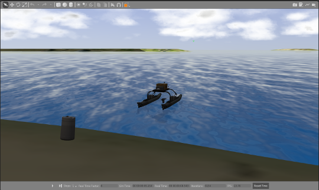
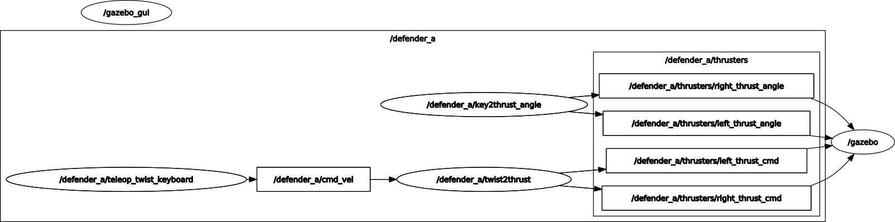
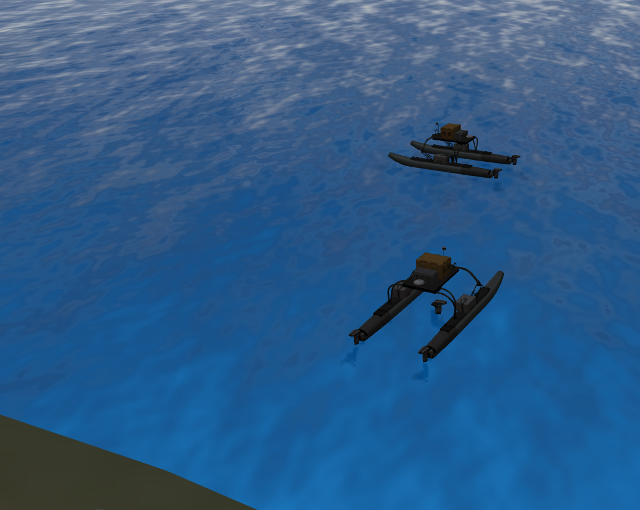
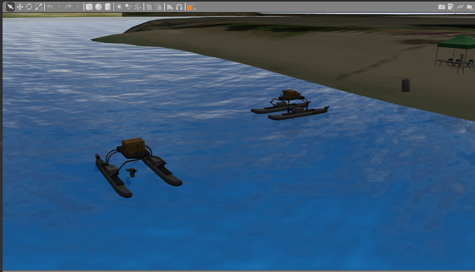
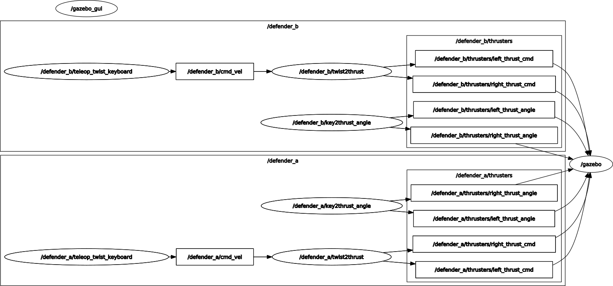

# RXI Tutorial: Operating Multiple Vehicles

Operating more than one robot can be challenging, but using namespaces and remapping can help when working with multiple robots.  In this tutorial we will spawn two WAM-V robots within a Gazebo simulation and demonstrate how namespaces can be used to teleoperate the two robots independently.  If time allows, we will work on a leader-follower configuration where a follower WAM-V automatically drives toward the teleoperated leader robot.  

## Resources ##

The following resources and reference discuss the use of namespaces and remapping to facilitate working with multiple robots. 

* [ROS Names](http://wiki.ros.org/Names) documentation
* [A Gentle Introduction to ROS](https://www.cse.sc.edu/~jokane/agitr/) by Jason M. O'Kane, Chapter 5: Graph Resource Names.
* Roslaunch [<group> tag](http://wiki.ros.org/roslaunch/XML/group) - notice the namespace (ns) attribute
* Roslaunch [<remap> tag](http://wiki.ros.org/roslaunch/XML/remap)

## Setup

### RXI package

We will be using the same RXI ROS Package as we work through this scenario.  The previous tutorial ,[Custom Worlds](https://bitbucket.org/osrf/vrx/wiki/tutorials/rxi/custom_worlds), describes setting up that tutorial in your VRX catkin workspace.  We will continue to assume that this ROS package is located in `~/vrx_ws/src/vrx`.

### Start with working launch file

As we did in the previous tutorial, we will start by copying a working launch file from VRX into our RXI package.
```
cd ~/vrx_ws/src/rxi/launch
roscp vrx_gazebo vrx.launch ./rxi_multi.launch
```

Verify that you can execute this launch file
```
roslaunch rxi rxi_multi.launch verbose:=true
```

The optional `verbose:=true` argument can help with debugging.  Also, if the system is running slowly, you can change the default world model by editing the `rxi_multi.launch` file to substitute the following default world.
```
<arg name="world" default="$(find vrx_gazebo)/worlds/sandisland.world" />
```


This should generate a Gazebo window that looks something like this...



### Teleop

Verify that you can teleoperate the USV.  For the tutorial we will be using the keyboard teleoperation, but if you have a gamepad feel free to use that for teleoperation.  Details on teleoperation are at the [Driving](https://bitbucket.org/osrf/vrx/wiki/tutorials/Driving) VRX tutorial.

You should be able to interact with the propulsion system using the keyboard teleoperation:
```
roslaunch vrx_gazebo usv_keydrive.launch
```

If you were to look at the ROS graph it would look like

showing two nodes (`twist2thrust` and `key2thrust_angle`) publishing thrust commands to the simulated WAM-V in the `gazebo` node.  Notice that the thruster topics are have two prefixes: `wamv` and `thrusters`.  These  [ROS Names](http://wiki.ros.org/Names) act somewhat like a directory structure to contain the ROS topics will allow us to have multiple copies of the same topics in different namespaces. 

## Changing the WAM-V namespace

Edit the `rxi_multi.launch` file.  The launch file defines a command line argument `namespace` and a default value for that argument of `wamv`.  Replace the `namespace` argument the following:

1. An argument named `namespace_a` with default value `defender_a`
2. A second argument named `namespace_b`with default value `defender_b`
3. In the remainder of the file, replace `$(arg namespace)` with `$(arg namespace_a)`
4. The last node in the file is the `spawn_model` node.  It includes a `-model` argument.  Change the option to `-model defender_a`

Restart the simulation 
```
roslaunch rxi rxi_multi.launch verbose:=true
```

If you inspect the ROS topics (e.g., `rostopic list`)  you will see that the simulated WAM-V is subscribed to thruster topics such as `/defender_a/thrusters/right_thrust_cmd` - within the new `defender_a` namespace.

Furthermore, if you try to run the teleoperation
```
roslaunch vrx_gazebo usv_keydrive.launch
```
you will not be able to move the USV.  This is because the teleoperation nodes are publishing the commands with the `wamv` namespace and gazebo is subscribing to the `defender_a` namespace.  We can look at the ROS graph to illustrate the disconnect:


## Changing the teleop namespace

For the teleoperation nodes to communicate with the USV, we need to change the naming of the teleoperation nodes.

First, copy the teleop launch file to your RXI package so that we can make changes within our custom package:
```
roscd rxi/launch
roscp vrx_gazebo usv_keydrive.launch ./defender_keydrive.launch
```

Our goal is to modify this launch file to be more general.  Currently the commands create a few nodes that publish/subscribe in the `/wamv` namespace.  We are going to make the launch file more general so that we can specify the namespace from the command line.  This will allow us to use the launch file repeatedly to work with multiple USVs.

Edit our new `defender_keydrive.launch`

* Add a new command line argument to the launch file so that we can specify the namespace for the teleoperation nodes.  This line should be after the opening `<laaunch>` tag:
```
<arg name="namespace" default="defender_a"/>
```
* After the `<arg>` tags, add a new `<group>` tag to specify the namespace based on the value of the namespace argument.  This causes all nodes and topics within the group tag to be encapsulated within the namespace defined by the `ns` value.  The opening tag should be
```
  <group ns="$(arg namespace)">
```
* Place the closing `</group>` tag at the end of the file, just before the `</launch>` tag.
* Examining the `<remap>` tags within the nodes you will see that the topics have been specifically put in the `/wamv` namespace.  In order for the namespace grouping to take affect, we need to remove this specification, so we remove the `/wamv` prefix from the `to` arguments in all the `<remap>` sections.
    * We can do this by searching for `/wamv/thrusters/` and replacing with `thrusters/`
* Run the teleoperation nodes with
```
roslaunch rxi defender_keydrive.launch 
```
or more explicitly
```
roslaunch rxi defender_keydrive.launch namespace:=defender_a
```

If all is well, you should now be able to teleoperate the USV because the teleoperation nodes are connected to the gazebo node using the `defender_a` namespace as illustrated in the ROS graph below.  Note that both the nodes and topics are now in the  `defender_a` namespace.




## Adding a second WAM-V

Next we will edit our `rxi_multi.launch` file to spawn two WAM-V USVs.  In the original file the WAM-V is created in two steps:

1. A `<param>` tag is used to load the URDF xacro description.  This operation includes calling the `xacro` program to process the `wamv_gazebo.urdf.xacro` which includes a namespace argument.  The output of the xacro processing is pushed to the parameter server. 
2. A `spawn_model` node is started.  This node reads the robot description from the parameters server (step 1) and loads the model into gazebo via the gazebo_ros interface.

You will want to copy both of these steps so they are done twice in the launch file to spawn two independent copies of the WAM-V USV.  The original copy will make use of the `namespace_a` argument (see above) and the second copy will use the `namespace_b` argument to generate a second WAM-V within the `defender_b` namespace.

When you spawn the second WAM-V you should offset the initial pose so the two vehicle are not in the same location.  Offset the pose by 10 m in x and y and by pi/2 in yaw.

Note that each node in the roslaunch file needs to have a unique name, so you will need each instance of the `spawn_model` node to have a unique name value.

If all goes well you should have two instances of the WAM-V in the same simulation.





## Teleop the second WAM-V

Above we generalized the `defender_keydrive.launch` file so that it created the keyboard teleoperation nodes and topics within namespace specified on the command line.  We should now have two simulated WAM-V USVs, one in the `defender_a` namespace and one in the `defender_b` namespace.  We will need to separate teleoperation systems to interact with these two USVs.  Launch two instances of the teleop system:

1. `roslaunch rxi defender_keydrive.launch namespace:=defender_a`
2. `roslaunch rxi defender_keydrive.launch namespace:=defender_b`

If all goes well you should have both telop systems interacting with the gazebo simulated USVs as illustrated in this ROS graph.



And here is a short [video clip](coming soon) illustrating moving the two USVs via keyboard.


## Working Example

Making all the adjustments to get two USVs in the simulation with teleoperation is challenging.  We've provided a working example to illustrate one way to get this working: [RXI ROS package](https://bitbucket.org/brian_bingham/rxi)

Here are the instructions that should provide a working example:

* Clone the repository in your VRX catkin workspace and make
```
cd ~/vrx_ws/src
git clone git@bitbucket.org:brian_bingham/rxi.git
cd ~/vrx_ws
catkin_make
source devel/setup.bash
```

* Start the simulation: `roslaunch rxi rxi_multi.launch verbose:=true`
* Start the keyboard teleop in two different namespaces:
    * `roslaunch rxi defender_keydrive.launch namespace:=defender_a`
    * `roslaunch rxi defender_keydrive.launch namespace:=defender_b`
* Optional: Examine the ROS graph: `rosrun rqt_graph rqt_graph`


